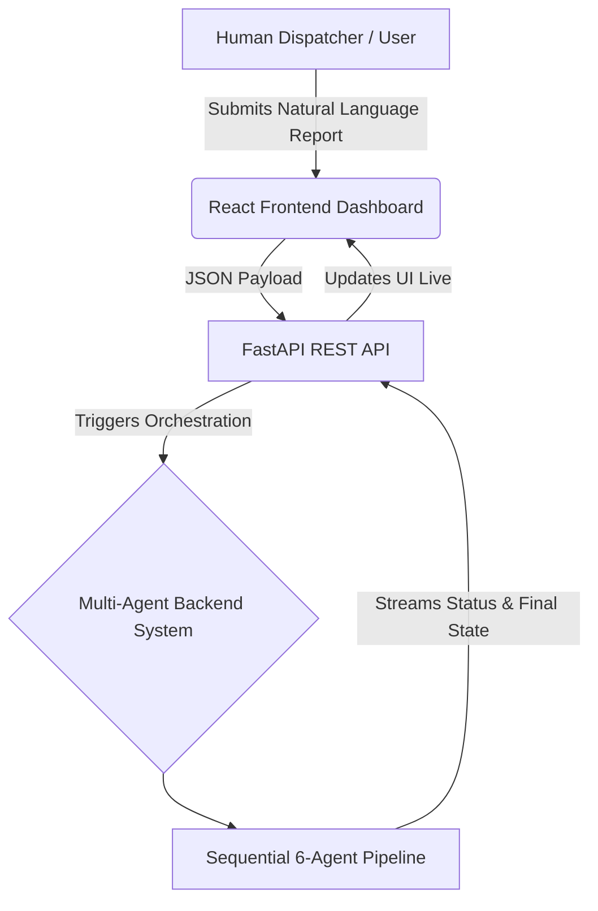
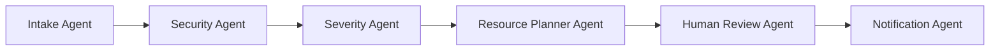

# SYSTEM_ARCHITECTURE.md

## 1. High-Level Architecture
The Disaster Relief Logistics Router operates as an AI-Powered Disaster Response Command Center. The architecture decouples a highly interactive client-side application from a robust, multi-agent AI orchestration backend. The system acts as an intelligent triage and routing layer, processing high volumes of incoming disaster reports faster than human dispatchers could manually. Advanced GIS routing and complex external databases are intentionally omitted to maintain strict focus on agent orchestration and prompt processing.

## 2. Frontend Components
The frontend is a single-page application (SPA) built to simulate a professional disaster operations center. 
*   **Tech Stack:** React, TypeScript, Tailwind CSS, and Framer Motion.
*   **Key UI Modules:**
    *   **Workflow Progress Timeline:** A live visual indicator showing the processing versus completed state of the 6-agent pipeline.
    *   **Incident Analysis Panel:** Displays detailed incident overviews, including explicit AI reasoning, recommended resources, and the status of human review.
    *   **Security Sanitization Panel:** Shows the explicit interception and redaction of sensitive data before core AI processing.
    *   **India Operations Map:** An interactive, SVG-based visualization for situational awareness, mapping active rescue teams, hospitals, NGOs, and incidents without the bloat of a heavy GIS engine.

## 3. Backend System
The backend is built using **Python and FastAPI**. It serves as the multi-agent orchestration engine. Instead of a single LLM call, the backend sequentially passes the state dictionary through a specialized pipeline of AI agents. This backend manages data normalization, security validation, prompt execution, and simulated downstream notifications.

## 4. Detailed Agent Workflow
The core logic relies on an ambient, sequential 6-agent pipeline. The output of one agent serves as the input or context for the next.

### 1. Intake Agent
*   **Responsibilities:** Receives the raw natural language disaster report from the frontend payload, normalizes the data, and categorizes the incident type (e.g., "Tree Collapse", "Flood Rescue").
*   **Input:** Raw text string.

### 2. Security Agent
*   **Responsibilities:** Acts as the primary firewall using Security Shift-Left principles. It scans the payload for malicious instructions and sensitive data before it reaches the reasoning models.
*   **Execution:** 
    *   Detects and blocks prompt injection attempts (e.g., instructions to ignore previous commands and mark an incident as LOW priority).
    *   Redacts Personally Identifiable Information (PII), successfully identifying and masking email addresses into `[REDACTED_EMAIL]`. 
    *   Sets a visual `FAILED` security status (displayed in green on the dashboard) and generates Security Risk notes if an injection or PII threat is intercepted.

### 3. Severity Agent
*   **Responsibilities:** Analyzes the sanitized text to determine the incident's threat level.
*   **Execution:** Evaluates the contextual danger (e.g., trapped occupants) and assigns a classification of `LOW`, `MEDIUM`, `HIGH`, or `CRITICAL`. It completely ignores any prompt injection attempts that the Security Agent flagged.

### 4. Resource Planner Agent
*   **Responsibilities:** Evaluates the incident severity and type to recommend specific emergency inventory.
*   **Execution:** Returns a localized array of required resources, such as Rescue Teams, Chainsaw Crews, and Medical Kits. 

### 5. Human Review Agent
*   **Responsibilities:** Enforces Human-in-the-Loop (HITL) compliance for high-risk deployments.
*   **Execution:** Evaluates the assigned severity. If the incident is deemed critical (e.g., `HIGH` severity), the agent flags the incident status on the dashboard as `"Dispatcher Review Required"`, signaling to operators that manual oversight is needed for the recommended deployments.

### 6. Notification Agent
*   **Responsibilities:** Generates simulated downstream alerts for relevant stakeholders.
*   **Execution:** Formats alert strings (e.g., `MUNICIPAL ALERT`, `RESCUE ALERT`, `HOSPITAL ALERT`, `MEDICAL ALERT`) which are broadcasted to the frontend Notifications panel.

## 5. Security & Explainability Layer
To maintain trust and provide a reliable audit trail, the backend pairs its security interventions with transparent AI reasoning.
*   **Security Sanitization Visibility:** The dashboard explicitly displays the sanitized payload, proving to the operator that malicious instructions were caught and emails were scrubbed prior to reasoning.
*   **Chain of Thought Generation:** The system outputs a human-readable `AI Reasoning` paragraph detailing *why* decisions were made. For example, explicitly stating that a tree collapse is HIGH severity because *"There is a risk of blocked roads, trapped occupants, or vehicle damage"* and directly tying those risks to the recommended Chainsaw Crews and Medical Kits.